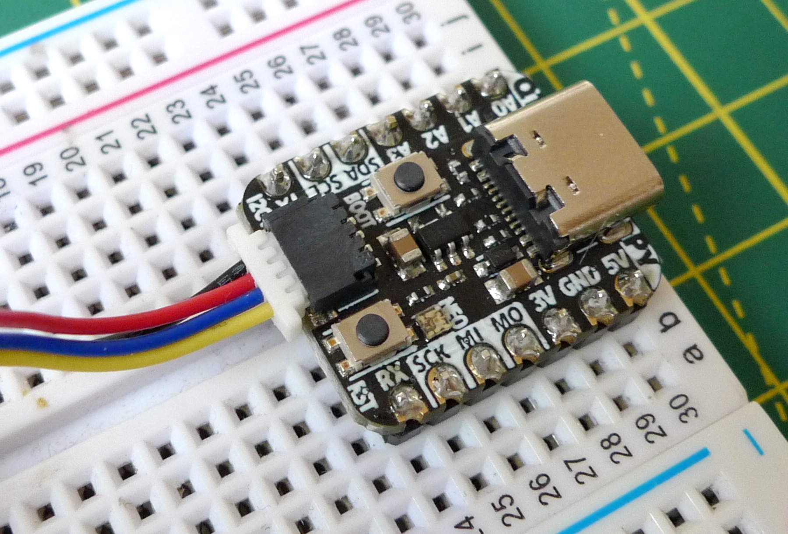

# Picoprobe

A Picoprobe is a Raspberry Pi RP2040-based Serial Wire Debug (SWB) adaptor. You can make one from a Raspberry Pi Pico — hence the name — or almost any third-party RP2040-based board. Use it to connect your RP2040-based application board to your personal computer for debugging through `gdb`, directly or via an IDE such as Microsoft Visual Studio Code.

This code originally supported only the Pico. It now supports three more boards, each of which provides a [STEMMA QT connector](https://learn.adafruit.com/introducing-adafruit-stemma-qt/what-is-stemma-qt)/[Qwiic](https://www.sparkfun.com/qwiic) for easy cabling to the application board under test. These connectors are intended for use with I&sup2;C devices, but here we’re using their pins for GPIO and power.

The code also uses the WS2812 RGB LED on those boards that have one as an SWD activity indicator.

If your chosen board is not one of those so far supported by the Picoprobe code, you should be able to use it with just a few small code changes.

## Build the Picoprobe code

To build the code for your own Picoprobe with VSCode:

1. Open the `<YOUR_GIT_DIRECTORY>/picoprobe` in VSCode.
1. Select the `CmakeLists.txt` file.
1. Look for the line `set(PICO_BOARD "pico")`.
1. Replace `"pico"` with the name of your board, eg. `set(PICO_BOARD "adafruit_feather_rp2040")`
    * You must use the board’s name as defined by the [Pico SDK](https://github.com/raspberrypi/pico-sdk/tree/master/src/boards/include/boards).

To build the code for your own Picoprobe at the command line:

1. Run `cd <YOUR_GIT_DIRECTORY>/picoprobe`.
1. Run `export PICO_BOARD=<YOUR_BOARD_NAME>`.
    * You must use the board’s name as defined by the [Pico SDK](https://github.com/raspberrypi/pico-sdk/tree/master/src/boards/include/boards).
1. Run `cmake -S . -B build/`.
1. Run `cmake --build build`.

To install the application:

1. Build your `.uf2` file, which will be located at `build/picoprobe_<YOUR_BOARD_NAME>.uf2`.
1. Hold down the **BOOTSEL** or equivalent button on your Picoprobe board and connect it to your your computer.
1. Release the button.
1. Copy your `.uf2` file over to the `RPI-RP2` drive that will appear on your computer’s desktop or via its file system.

## Using SWD

For more information on connecting your Picoprobe to your application board and running debug sessions, please see [**Getting started with Raspberry Pi Pico**](https://datasheets.raspberrypi.org/pico/getting-started-with-pico.pdf), Appendix A.
